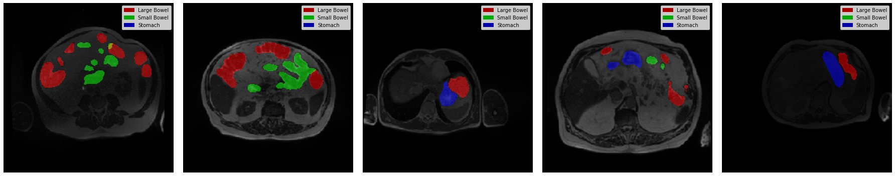
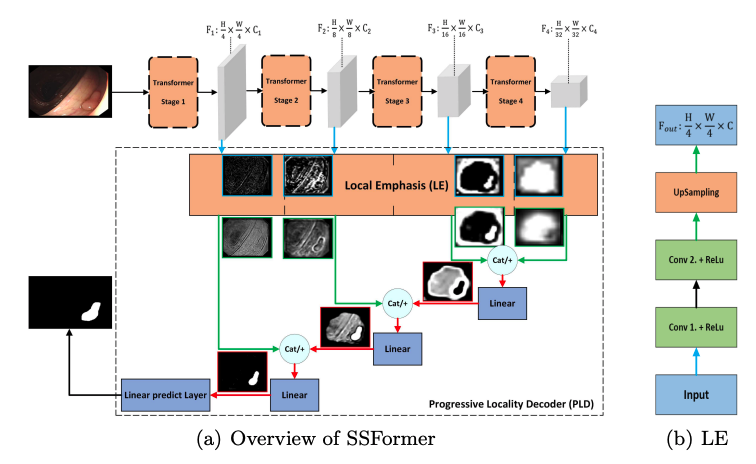

# UW-Madison GI Tract Image Segmentation Kaggle Competition 

The goal of this competition ([competition link](https://www.kaggle.com/competitions/uw-madison-gi-tract-image-segmentation/overview)) was to create a model that automatically **segments** the stomach and intestines on consecutive MRI scans.

Using the code in this repo, I won a **bronze medal** in this competition and ranked in the top 7% of all contestants (103/1554). 🥉

This repository mainly exists so I can remember what I learned in this competition.


I took this nice visualization from [here](https://www.kaggle.com/code/awsaf49/uwmgi-unet-train-pytorch).

## Approach

Here, I will explain my approach and analyze what was missing to reach the top spots. This analysis is only possible since the best competitors were nice enough to discuss their solutions in the [competition forum](https://www.kaggle.com/competitions/uw-madison-gi-tract-image-segmentation/discussion).

### Model

As my model, I used the SSFormer from the [Stepwise Feature Fusion: Local Guides Global](https://arxiv.org/pdf/2203.03635v1.pdf) paper. The encoder used in this model comes from the [Segformer paper](https://arxiv.org/pdf/2105.15203.pdf) and is a transformer-based architecture that also incorporates CNN properties.



I used SSFormer-S, which is a SSFormer version with fewer parameters. Moreover, [pretrained weights](https://drive.google.com/file/d/1CdX0K1_ZDMrEVGK2cmBfp33lYxLEBwlw/view) were used to initialize the model in the beginning.

### Settings
- 5 "stratified-group-fold" ensemble
  - group splitting by case
  - ensembling by averaging over the model outputs 
- 2.5D input -> add one slice before and after target slice with stride two (for slice 3, we get [slice 1, slice 3, slice 5])
- batch size of 4 (due to memory limit and I wanted to train two models at a time)
- 30 epochs
- polynomial LR scheduler with start LR 1e-4 and end LR 1e-7
- resize images to 640x640
- random rotation, crop and dropout augmentations during training
- horizontal flip test time augmentation
- 0.5 DiceLoss + 0.5 BCELoss

### What was missing to the top places?

- do the same thing I did for one model with several models and ensemble them
  - this is the **single most important point** (probably giving the largest boost)
  - my SSFormer is already on par with single 2.5D models of the top solutions (when they were trained on all the data like mine)
  - I also had an Unet (EfficientNet encoder) with similar (but slightly worse) performance than my SSformer, which I did not use (because I got tricked by the public leaderboard)
  - an other example: by only adding an older version of my SSFormer ensemble to the whole ensemble, I could have ended up at rank 63 (I evaluated this ensemble but did not choose it for the final submission (because I got tricked by the public leaderboard again))
- use some kind of classifier to detect if the given slice has a non-zero mask or not (i.e. if stomach or intestines are shown on the image or not)
  - train this classifier (better also as ensemble) on the whole data
  - then, train segmentation models only on the data containing masks so that they can fully focus on this task (since there was not too much data in this competition)
  - during inference, set mask to zero if the classifier says that there is no mask, otherwise use the segmentation models
- many top teams also used 3D models, which performed very well, in their ensembles
- in preprocessing, use a localizer to focus on the important parts of the image and to reduce the background
  -  it's not worth to waste computing time on irrelevant parts of the image + on whole images, the model has to learn scale and shift variance
  -  might require manual annotation to train a simple CNN localizer
- use stronger augmentation; seemed to have helped a lot of competitors but didn't in my tests; maybe check more carefully next time
- team up
  - everything I just mentioned here takes a quite some time to implement and tune
  - also gpu times are often limited
  - hence, team work makes the dream work 

### Other tricks and notes that might be useful in future competitions
- use 16 bit floating point precision to speed up training, inference and save gpu memory.
- Consider deep supervision loss 
  - i.e. compute loss already in middle parts of the architecture to give stronger signals
- ensembles are important in general but especially in this competition since there wasn't to much data

## Installation

Python packages are installed in a virtual environment and not directly in the docker container. This way it is faster to add and remove packages.

You can use vscode to develop in the docker container directly, but it is also possible to use the docker container outside of vscode.

### With vscode
Build the image and start the container with ```Strg + Shift + P``` -> ```Remote-Containers: Rebuild Container```

Now you can run develop and run code within the docker container.

### Without vscode
Build the image with
```shell
docker build -t umwgit path-to-repo/umwgit/.devcontainer
```
Then, install the python packages inside the container
```shell
docker run --runtime nvidia --gpus all -v path-to-repo/umwgit:/app -w /app -it umwgit
# in the interactive container install python packages
source .devcontainer/postCreateCommand.sh
```

## Data
Download the data from the [competition website](https://www.kaggle.com/competitions/uw-madison-gi-tract-image-segmentation/data) (contains train, sample_submission.csv, and train.csv) and store it in the following way: 
```
umwgit
│   README.md   
└───data
│    │   sample_submission.csv
│    |   train.csv
│    └───train
│          | ...
└───umwgit
│    │ ...
│    └───pretrained
│           └───ssformer_S.pth
│ ...
```
Then, activate the virtual environment in the container if it is not already activated and run the data preparation scripts.
```shell
source venv/umwgit/bin/activate
python3 scripts/prepare_data.py
python3 scripts/create_folds.py
```
These scripts create the segmentation masks from the used encoding in data/train.csv, handle the paths, and create the files containing the indices for the five folds.

Also download the [pretrained weights](https://drive.google.com/file/d/1CdX0K1_ZDMrEVGK2cmBfp33lYxLEBwlw/view) for the SSFormer-S and put them at the location shown above.
## Usage
I used the following command and arguments for my training (e.g. for fold 0)
```shell
# venv must be activated
python3 train.py --name fold0 --fold 0 --device cuda \
    --image_size 640 --batch_size 4 --epochs 30 \
    --lr 1e-4 --end_lr 1e-7 --max_decay_steps 30 
```
Check out the *parse_args* function in [umwgit/utils.py](umwgit/utils.py) and [train.py](train.py) to get more information about the parameters and how to use them. Also, the code should be self-explanatory and easy to adapt.

### Misc
- [test.py](test.py) contains some tests I made
- [misc/submission_nb.py](misc/submission_nb.ipynb) is the notebook I used to make the submissions on Kaggle. It is not clean at all and won't run here, but still might be useful in future competitions.
